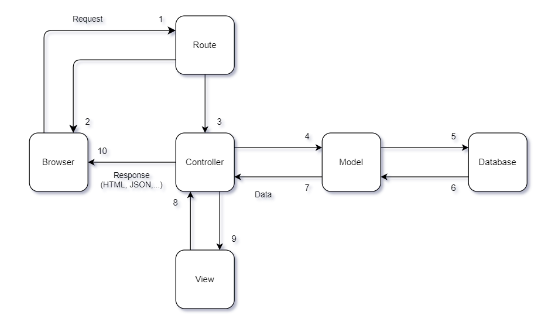

# PHP MVC Tutorial

[Switch to Vietnamese Document](https://github.com/De-Ying-Course/php-mvc-tutorial/blob/main/README-VI.md)

## Design Pattern MVC



## Knowledge required

> Model MVC (Model - View - Controller)

```
1. Master the basics of PHP
2. Knowledge of URL Rewrite
3. Regular Expressions
	3.1. Apache: `.htaccess`
	3.2. Nginx: `config nginx`
4. Knowledge of object-oriented programming (OOP)
5. Mastering the module model (Pure Code)
6. Content deployment
    6.1. Configure URL Rewrite
    6.2. Code file index.php
    6.3. Code file bootstrap.php
    6.4. Code Controllers
    6.5. Code Models
    6.6. Code Views
    6.7. Code Routes
    6.8. Code Database
    6.9. Application optimization
```

## Shared content

> Part 1: Routes, Controllers

```
1. Configuration file `.htaccess`
2. Handling navigation (routes) - Call the respective controllers - `App.php`
3. Controllers - Class & Action
```

> Part 2: Models

```
1. models
2. core
    > Controller.php (Base Controller): Write handling functions
        > Fnc model($model)
3. Load model into controller
```

> Part 3: Views

```
1. views - Each controller corresponds to 1 module `view`
2. core
    > Controller.php (Base Controller): Write handling functions
        > Fnc render($view, $data=[])
3. Load view into controller
```

> Part 4: Master Layout

```
1. Extract data through layout
    > Sending data from controller side to view side via layout requires a 2-dimensional array
2. public
    > assets
        > clients > css + fonts + images + js + ...
        > admin > ...
```

> Part 5: Routes

```
1. Dealing with handle-related matters
2. Replace via `App.php` variable
```

